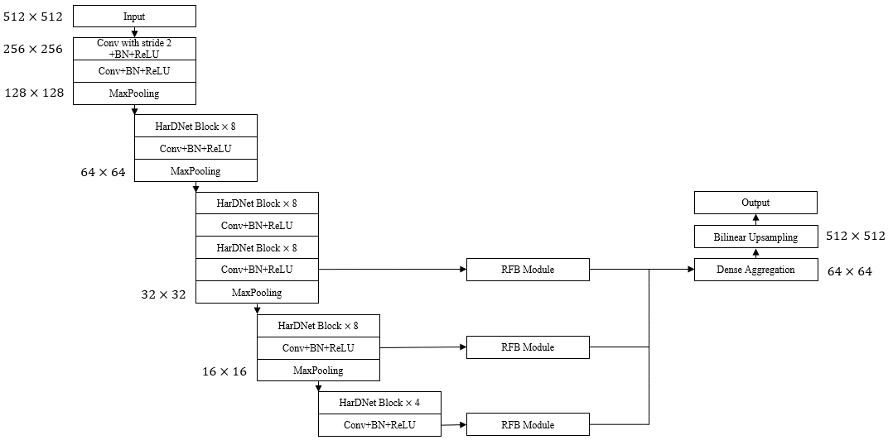

# Implementation of HarDNet-MSEG using PyTorch Deep Learning Framework
 
The architecture was inspired by Hardnet-mseg: A simple encoder-decoder polyp segmentation neural network that achieves over 0.9 mean dice and 86 fps. 

## Overview
This repository contains an unofficial implementation of HarDNet-MSEG using PyTorch.<br/>
Please refer to the paper at the following page: 
[Hardnet-mseg: A simple encoder-decoder polyp segmentation neural network that achieves over 0.9 mean dice and 86 fps](https://arxiv.org/abs/2101.07172 "Visit")

## Model

## Paper
If you use this software for your research, please cite:

```bibtex
@article{huang2021hardnet,
  title={Hardnet-mseg: A simple encoder-decoder polyp segmentation neural network that achieves over 0.9 mean dice and 86 fps},
  author={Huang, Chien-Hsiang and Wu, Hung-Yu and Lin, Youn-Long},
  journal={arXiv preprint arXiv:2101.07172},
  year={2021}
}
```

## License
This program is available for download for non-commercial use, licensed under the GNU General Public License. This allows its use for research purposes or other free software projects but does not allow its incorporation into any type of commercial software.

## Files
The repository contains the following files:

- `HarDNet_MSEG.py`: Python script file, containing the PyTorch implementation of the HarDNet_MSEG.
- `README.md`: Markdown file explaining the model source code.
